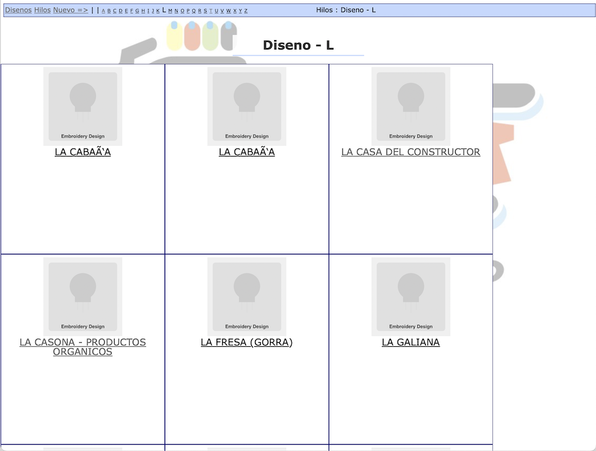
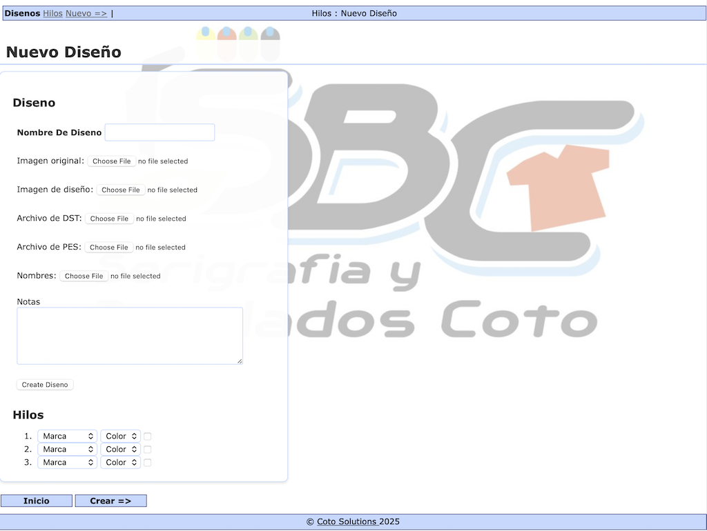
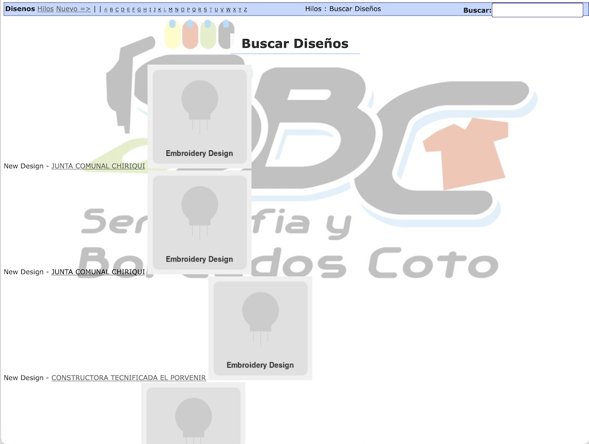

# Diseños - An Embroidery Design Management System

From 2008 to 2011, I built Diseños as part of a business management suite for S.B.C. Panamá, my family's embroidery business in David, Panama.

While building [Inventario](https://github.com/dewittn/rails-sbc-inventario) to solve the inventory chaos, I noticed a second bottleneck: workers were spending 20+ minutes hunting for design files and machine setup instructions every time they started an order. They needed to find the right embroidery file (DST or PES format), figure out which thread colors to load, and print configuration sheets. When they couldn't find what they needed, they interrupted my brother, the production manager and lead designer. Every interruption meant designs stalled and production slowed. He was spending hours each day being a human filing cabinet instead of running the business.

To solve this, I built a searchable database of embroidery designs with visual thread color breakdowns, attached machine files, and a custom JavaScript colorpicker for selecting thread colors visually rather than by code. The interface matched what workers needed to fulfill production orders: by appearance and color, not by filename or database ID.

The result: machine setup time dropped from 20+ minutes to under 1 minute. Workers could find everything themselves. The system also created a compounding effect: the design library became a cache for repeat customers, decoupling revenue growth from designer availability.

The application ran in production for over 5 years and became the most actively developed component of the suite with 206 commits. It was part of a system that supported approximately $1.55M in total revenue over six years.

Read the full [S.B.C. Panamá case study](https://nelsonroberto.com/portfolio/sbc-panama/).

## What This Project Demonstrates

**Product design focused on UI/UX.** I designed the entire system from problem discovery through interface design. Where Inventario required multiple iterations to get the workflow right, Diseños let me apply those lessons from the start and focus on UI/UX: how do workers identify designs visually? How do they select thread colors without memorizing codes? I integrated a JavaScript colorpicker for visual color selection, built thread breakdowns with color swatches, and designed the interface around what workers needed to fulfill production orders, by appearance rather than filename.

**Sustained development intensity.** June 2009 saw 87 commits in a single month: Spanish/English internationalization (215 lines of translations), Cucumber BDD testing, timeline events for audit trails, email sharing functionality, and colorpicker integration. This was production engineering with comprehensive testing and localization, not just feature work.

**Production-grade engineering.** The system ran in production for over five years serving a real business. It included full-text search with Thinking Sphinx, model-level caching, RESTful AJAX patterns, and complete bilingual support. I deployed and maintained it remotely from Boston via Hamachi VPN and Capistrano, with production monitoring through NewRelic.

**Part of a larger system.** Diseños was one of five applications in the S.B.C. business management suite, totaling 15,400 lines of code and 441 commits across 42 months. I built and maintained all of it remotely while traveling between Boston and Panama.

## Screenshots

### Design Detail
View individual designs with their thread color breakdown, including brand, color name, code, and color swatch.


### Design Gallery
Browse designs alphabetically with a grid layout.



### New Design Form
Create new designs with file uploads (DST/PES embroidery files) and thread color selection.



### Timeline
Track recent design activity and search across all designs.



## Overview

This application helps manage embroidery designs by:

- Storing design files (DST/PES embroidery formats) with preview images
- Tracking thread colors per design with visual color swatches
- Recording design activity through timeline events

**Tech Stack:**

- Ruby 2.3.8
- Rails 4.2.11.3
- MySQL 8.0 (production/development), SQLite3 (test)

## Quick Start

**Prerequisites:** Docker and Docker Compose

1. Clone the Repository

   ```bash
   git clone https://github.com/dewittn/rails-sbc-disenos
   cd rails-sbc-disenos
   ```

2. Configure Environment Variables

   ```bash
   # Copy the example environment file
   cp .env.example .env

   # (Optional) Edit .env to customize database credentials
   # nano .env
   ```

3. Start the Application

   ```bash
   # Build and start all services
   docker-compose up -d

   # Wait for services to start (about 30 seconds)
   # Check service status
   docker-compose ps
   ```

4. Initialize the Database

   ```bash
   # Run the database setup script
   ./docker/db_setup.sh

   # Or manually run:
   docker-compose exec web bundle exec rake db:create db:migrate db:seed
   ```

5. Access the Application

   Open your browser and navigate to:

   ```
   http://localhost:3000
   ```

## Documentation

See the [docs](./docs) folder for detailed information:

- **[Development Guide](./docs/development.md)** - Docker setup, database commands, testing workflow
- **[Architecture](./docs/architecture.md)** - System design, domain models, custom plugins
- **[Business Impact Analysis](./docs/case-study.md)** - Operational efficiency gains and revenue impact

## AI Usage

This repository includes retrospective work completed with AI assistance in 2024:

- **Docker containerization** (2024): Claude Code assisted with Dockerfile, docker-compose.yml, and MySQL 8 migration
- **Documentation organization** (2024): Claude Code helped restructure README and create docs/ folder
- **Data analysis** (2024): Claude Code performed forensic analysis of production database exports to quantify business impact

The original application code (2009-2011) was written entirely without AI assistance.

## License

MIT
